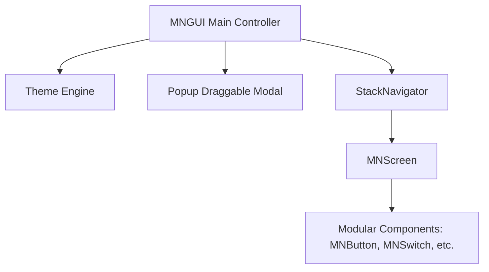

# Bản đồ Kiến trúc MNGUI (Architecture Map)

Giấy hướng dẫn kiến trúc lõi dành cho AI Agent để định hướng viết code đồng nhất với toàn bộ hệ thống thư viện MNGUI.

---

## 1. Phân tầng Kiến trúc (Core Layers)

Thư viện MNGUI được thiết kế theo mô hình tách biệt trách nhiệm (Separation of Concerns), phân làm 4 phân lớp lõi:

### 1.1. `BaseComponent` (Lớp Cơ sở)
- **Định vị**: Tọa lạc tại [BaseComponent.js](./src/core/BaseComponent.js). Là lớp cơ sở của toàn bộ các phần tử giao diện trong MNGUI.
- **Quy tắc quan trọng**:
  - Mọi component mới **bắt buộc** phải kế thừa `BaseComponent`.
  - Sử dụng phương thức `.style(css)` để định kiểu nhanh cho phần tử con.
  - Lắng nghe sự kiện thông qua phương thức bảo mật `.addEventListenerSafe(target, type, callback)` để tự động theo dõi, thu hồi sự kiện và ngăn ngừa rò rỉ bộ nhớ (memory leaks).

### 1.2. `Theme` (Động cơ Giao diện)
- **Định vị**: [Theme.js](./src/core/Theme.js). Quản lý toàn bộ hệ thống biến CSS toàn cục và chế độ Sáng/Tối.
- **Quy tắc**:
  - Giao diện gồm chế độ Tự động (`auto`), Sáng (`light`), và Tối (`dark`).
  - Hỗ trợ lưu trữ trạng thái chế độ màu qua lớp `StatePersistence`.

### 1.3. `Popup` (Bảng điều khiển nổi Draggable)
- **Định vị**: [Popup.js](./src/core/Popup.js).
- **Quy tắc**:
  - Là container vật lý chính chứa thanh tiêu đề, nút chuyển chế độ màu, nút đóng và phần hiển thị nội dung màn hình.
  - Hỗ trợ tính năng kéo thả (Draggable). Tọa độ kéo thả phải được giới hạn chặt chẽ bên trong khung hình trình duyệt (không được phép kéo chìm ra ngoài viewport).

### 1.4. `StackNavigator` (Bộ điều hướng Màn hình)
- **Định vị**: [StackNavigator.js](./src/core/StackNavigator.js).
- **Quy tắc**:
  - Quản lý quá trình chuyển đổi giữa các màn hình `MNScreen` dưới dạng ngăn xếp (Stack).
  - Tự động kích hoạt hiệu ứng chuyển động trượt ngang (Horizontal Slide transition) mượt mà khi đổi trang.

---

## 2. Cô lập Giao diện qua Shadow DOM

Để đảm bảo MNGUI hoạt động độc lập và không làm ảnh hưởng/nhiễu loạn CSS của trang web cha (Host website), toàn bộ giao diện của MNGUI được kết xuất trực tiếp bên trong một **Shadow Root** khép kín:

- **Định danh container**: `#mngui-root-container` (được chèn trực tiếp vào thẻ `<body>` của trang).
- **Quy tắc định vị overlays**: 
  - Do `#mngui-root-container` có kích thước mặc định là `0x0` để ẩn đi các mảng phụ, các cấu phần mang tính chất phủ toàn màn hình như **`MNToast`** và **`MNDialog`** bắt buộc phải sử dụng CSS **`position: fixed`** thay vì `position: absolute` để căn giữa và hiển thị hoàn hảo trên toàn bộ Viewport của trình duyệt.
