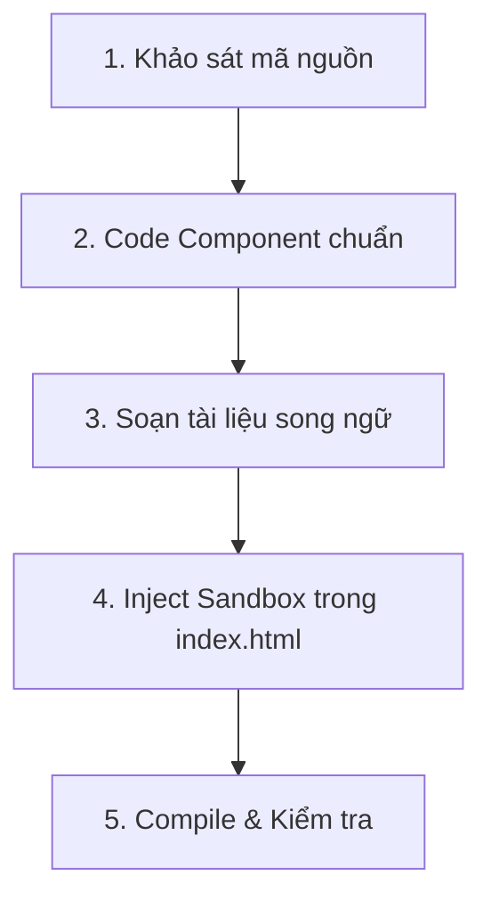

# Quy trình Phát triển & Biên dịch Tự động cho Agent (Agent Workflow Guideline)

MNGUI hỗ trợ chu trình phát triển tự động hóa hoàn toàn dành cho AI Agent. Hãy tuân thủ đúng quy trình 5 bước khép kín dưới đây để đảm bảo chất lượng phát triển cao nhất.

---

## 🛠️ Quy trình 5 bước phát triển khép kín (Core Development Loop)



### Bước 1: Khảo sát & Nhận diện
- **Hành động**: Đọc mã nguồn các component hiện tại trong thư mục `src/components/` để nắm rõ cấu trúc và vòng đời đối tượng.
- **Gotchas**: Đảm bảo component mới không trùng lặp chức năng và kế thừa chính xác từ `BaseComponent`.

### Bước 2: Viết mã nguồn Component
- **Hành động**: Định nghĩa component mới trong `src/components/MN[ComponentName].js`.
- **Ràng buộc**:
  - Không hardcode màu sắc, sử dụng biến CSS.
  - Sử dụng `.addEventListenerSafe` để đăng ký lắng nghe sự kiện.
  - Đăng ký xuất ra (export) trong tệp tổng `src/index.js` và `mngui.js`.

### Bước 3: Soạn thảo Tài liệu Song ngữ
- **Hành động**: Mở tệp [docs-data.js](./docs-data.js) và bổ sung định nghĩa markdown cho component mới bằng cả 2 ngôn ngữ: `vi` (Tiếng Việt) và `en` (English).
- **Ràng buộc tiêu đề**: 
  - Tiêu đề chính `<h1>` (ví dụ: `# MNButton — ...`) **tuyệt đối không chứa biểu tượng cảm xúc (emoji)** ở đầu để giữ giao diện thanh bên và tiêu đề trang tối giản, cao cấp.

### Bước 4: Tích hợp tự động vào Live Sandbox Popup
- **Hành động**: Mở tệp [index.html](./index.html) và cập nhật hàm `updateMNGUIDocsPreview(id)`.
- **Triển khai**: Thêm case block tương ứng với tên component mới dạng chữ thường để khởi tạo thử nghiệm thực tế:
```javascript
case "mnnewcomponent":
  const previewItem = new MNNewComponent("Tham số thử nghiệm");
  wrapper.append(previewItem);
  break;
```

### Bước 5: Biên dịch & Kiểm tra
- **Biên dịch**: Luôn chạy lệnh đóng gói esbuild để nén và đồng bộ mã nguồn:
```bash
npm run build
```
- **Kiểm thử chất lượng (DoD Check)**:
  - Xác nhận lệnh biên dịch chạy thành công với Exit code 0.
  - Không có thẻ preview sandbox cũ nào bị sót lại trên trang tài liệu (toàn bộ tương tác live chỉ được hiển thị bên trong Popup MNGUI thực sự).
  - Độ trong suốt của kính mờ đạt chuẩn pha lê `0.4` cả ở hai chế độ màu sáng/tối.
