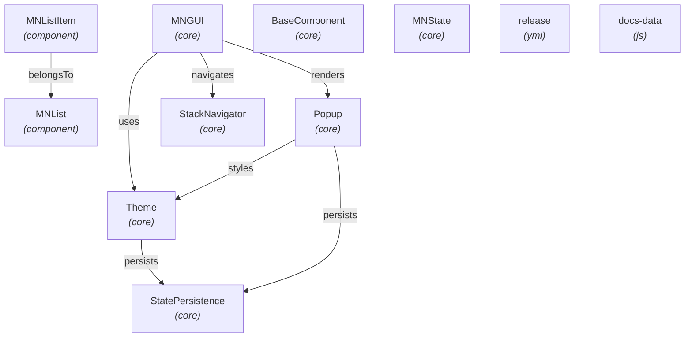

# Project Neural Logic Map

> 🧠 **Auto-generated by Neural Brain script.** Do not edit manually.
> Project: `/home/nghiapd/du-an-ngoai/mn-script/mn-gui`

```mermaid
graph TD;
  MNList["MNList<br/><i>(component)</i>"]
  MNListItem["MNListItem<br/><i>(component)</i>"]
  MNGUI["MNGUI<br/><i>(core)</i>"]
  Theme["Theme<br/><i>(core)</i>"]
  Popup["Popup<br/><i>(core)</i>"]
  StatePersistence["StatePersistence<br/><i>(core)</i>"]
  BaseComponent["BaseComponent<br/><i>(core)</i>"]
  MNState["MNState<br/><i>(core)</i>"]
  StackNavigator["StackNavigator<br/><i>(core)</i>"]
  release["release<br/><i>(yml)</i>"]
  docs_data["docs-data<br/><i>(js)</i>"]
  MNListItem -->|belongsTo| MNList
  MNGUI -->|uses| Theme
  MNGUI -->|renders| Popup
  MNGUI -->|navigates| StackNavigator
  Theme -->|persists| StatePersistence
  Popup -->|styles| Theme
  Popup -->|persists| StatePersistence
```
